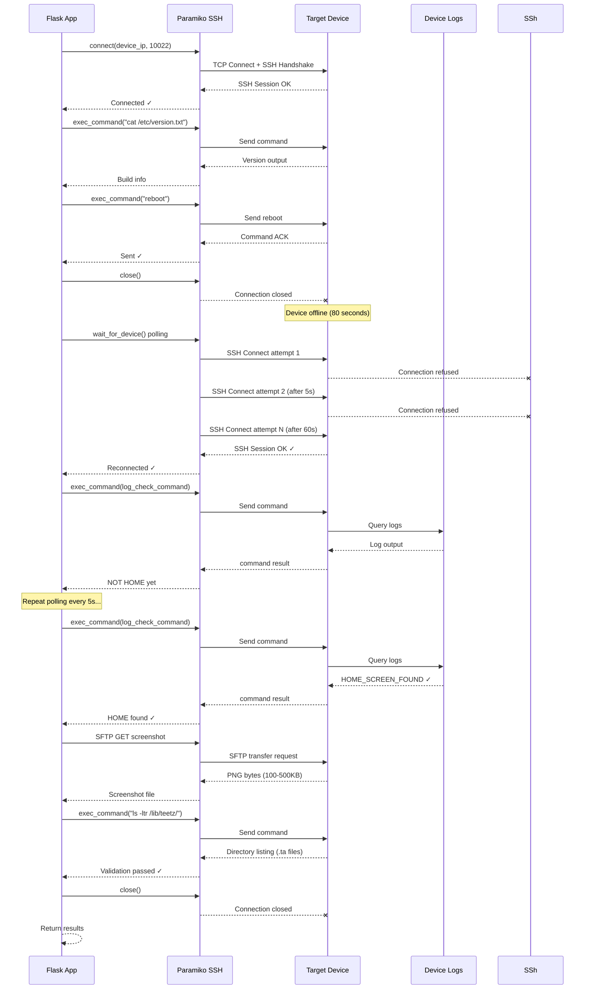

# Reboot Performance Optimized - Sequential Communication Flow

## Overview

The `execute_reboot_performance_process()` method in `method_reboot_performance.py` implements a comprehensive reboot performance monitoring workflow. This document details all sequential communication steps that occur between the Flask application, device, and various services.

---

## ⚡ TIMING COMPARISON: Regular SSH vs Lightspeed SSH API

### Executive Summary

```
EXECUTION TIME FOR ONE ITERATION:

Regular SSH (Paramiko - Direct):     ~5 minutes   (293-320 seconds)
Lightspeed SSH API (Cloud-based):    ~14-15 mins  (867-900 seconds)

PERFORMANCE IMPACT:  3x SLOWER with Lightspeed SSH
                     +574 seconds additional wait per iteration
                     +2870 seconds for 5 iterations

CRITICAL BOTTLENECK: Log polling phase
                     - Regular SSH: 110s (200ms × 30 polls)
                     - Lightspeed: 500s (16s × 30 polls)
                     - Difference: +390 seconds!
```

### Detailed Timing Analysis

```
PHASE                         REGULAR SSH    LIGHTSPEED SSH    OVERHEAD
═════════════════════════════════════════════════════════════════════════════

1. Pre-Reboot (6 commands)    ~2s           ~105s             +103s  (52x)
2. Send Reboot               ~0.3s          ~16s              +16s   (50x)
3. Mandatory Wait            80s            80s               Same    (Physical)
4. Device Reconnect          60-120s        60-120s           Same    (Physical)
5. Post-Reboot Init (3 cmds) ~1s            ~48s              +47s   (48x)
6. Log Polling (30 polls)    ~110s          ~500s             +390s  (4.5x)
7. Screenshot & Validate     ~10s           ~42s              +32s   (4x)

─────────────────────────────────────────────────────────────────────────

TOTAL PER ITERATION:          ~293s         ~867s             +574s  (3x)
                              (5 mins)      (14-15 mins)

5 ITERATIONS:                 ~1465s        ~4335s            +2870s
                              (24 mins)     (72 mins)         (3x slower)
```

### Why Lightspeed SSH is Slower

Each Lightspeed SSH command involves:
  1. OAuth token: 500-1000ms (first request), ~1ms (cached)
  2. Job submission (POST): 200-400ms
  3. Job polling (GET): 15-second minimum wait
  4. Result retrieval (GET): 100-300ms
  ─────────────────────────────
  **Total per command: ~16,000ms (16 seconds)**

Compared to regular SSH command: ~200-300ms

**Ratio: 50-80x slower per individual command!**

### Phase-by-Phase Impact

**WORST IMPACT:**
- Log Polling (Phase 6): 30 commands executed every 5 seconds
  * Regular SSH: 30 × 0.2s = ~6s (plus 5s waits = 150s total)
  * Lightspeed: 30 × 16s = ~480s (plus 5s waits = 630s total)
  * **Impact: +480 seconds per iteration!**

**MODERATE IMPACT:**
- Pre-Reboot Phase (Phase 1): 6 commands for build info
  * Regular SSH: ~2s
  * Lightspeed: ~96s (6 × 16s)
  * **Impact: +94 seconds per iteration**

- Post-Reboot Init (Phase 5): 3 commands after device comes online
  * Regular SSH: ~1s
  * Lightspeed: ~48s (3 × 16s)
  * **Impact: +47 seconds per iteration**

**NO IMPACT:**
- Device reboot itself (Physical hardware, not API-dependent)
- Device reconnection polling (TCP/SSH behavior unchanged)

```

---

## Complete Sequential Communication Diagram

```
┌─────────────────────────────────────────────────────────────────────────┐
│                     REBOOT PERFORMANCE METHOD                           │
│              Sequential Communication & Timing Analysis                 │
└─────────────────────────────────────────────────────────────────────────┘

STEP 1: PRE-VALIDATION
═══════════════════════════════════════════════════════════════════════════

[1.1] Initialize Execution Context
  ├─ Generate timestamp: 20260327_143022
  ├─ Create safe device name: Device_Name
  └─ Set execution mode: REBOOT_PERFORMANCE

[1.2] Create USB Log Path
  └─ Call: create_execution_log_path(device_ip, device_name, iteration, "REBOOT_PERFORMANCE")
     └─ Returns path to USB/execution log

[1.3] Connect to Device (SSH)
  ├─ TCP Connection: SSH → device_ip:10022
  ├─ SSH Handshake & Authentication
  ├─ Paramiko SSHClient.connect()
  │  ├─ Username: 'root'
  │  ├─ Password: provided
  │  ├─ Port: 10022 (default)
  │  └─ Timeout: 15 seconds
  └─ Log: "✓ Connected to device successfully"
     
          Time: ~200-500ms


STEP 2: FETCH BUILD DETAILS
═══════════════════════════════════════════════════════════════════════════

[2.1] Get Build Version
  ├─ SSH Command: "cat /etc/version.txt"
  ├─ Paramiko: ssh.exec_command(build_version_command)
  ├─ Receive stdout: build_output
  └─ Log: "Build: [version info]"

[2.2] Get Build Date
  ├─ SSH Command: (from config_commands.py)
  ├─ Paramiko: ssh.exec_command(build_date_command)
  └─ Log: "Build Date: [date]"

[2.3] Get Device Model
  ├─ SSH Command: "cat /proc/device-tree/model"
  ├─ Paramiko: ssh.exec_command(device_model_command)
  └─ Log: "Device Model: [model]"

          Total Time: ~200-400ms (3 concurrent-like SSH commands)


STEP 3: ACTIVATE SCREENCAPTURE SERVICE
═══════════════════════════════════════════════════════════════════════════

[3.1] Restart ScreenCapture Service
  ├─ SSH Command: "systemctl restart screencapture" (or similar)
  ├─ Paramiko: ssh.exec_command(activate_screencapture_cmd)
  └─ Wait for response
  
[3.2] Verify Service Status
  ├─ SSH Command: "systemctl status screencapture"
  └─ Log: "✓ ScreenCapture service activated"

          Time: ~300-500ms


STEP 4: CAPTURE REBOOT START TIME
═══════════════════════════════════════════════════════════════════════════

[4.1] Capture UTC Timestamp
  ├─ Get system time: datetime.now(timezone.utc)
  ├─ Store as: reboot_start_time
  ├─ Format: 2026-03-27 14:30:22.123456 UTC
  └─ Log Exact Timestamp: "⏱ Reboot command timestamp (UTC): 14:30:22.123456"

          Time: Microsecond precision (instant)


STEP 5: SEND REBOOT COMMAND
═══════════════════════════════════════════════════════════════════════════

[5.1] Execute Reboot Command
  ├─ SSH Command: "reboot" (from config_commands.py)
  ├─ Paramiko: ssh.exec_command(reboot_command)
  ├─ Read stdout for response
  ├─ Read stderr for errors
  └─ Log: "✓ Reboot command sent successfully"

[5.2] Close SSH Connection
  ├─ Paramiko: ssh.close()
  └─ Connection Closed (Device rebooting)

          Time: ~100-300ms for command transmission
          
          ⚠️  DEVICE GOES OFFLINE HERE


STEP 6: MANDATORY REBOOT WAIT PERIOD
═══════════════════════════════════════════════════════════════════════════

[6.1] Wait 80 seconds for Device Reboot
  ├─ Total Wait: 80 seconds (hardcoded)
  ├─ Chunked: 8 × 10-second intervals
  ├─ Progress Logging: Every 20 seconds
  │  ├─ 0s elapsed
  │  ├─ 20s elapsed (logged)
  │  ├─ 40s elapsed (logged)
  │  ├─ 60s elapsed (logged)
  │  └─ 80s elapsed (complete)
  └─ Log: "✓ 80 second wait complete"

          Time: Exactly 80 seconds
          
          🔴 DEVICE OFFLINE (Rebooting)


STEP 7: WAIT FOR DEVICE TO COME BACK ONLINE
═══════════════════════════════════════════════════════════════════════════

[7.1] Attempt SSH Reconnection (Polling)
  ├─ Call: wait_for_device(device_ip, port, username, password, log_message)
  ├─ Implementation Details:
  │  ├─ Max Wait Time: 180 seconds (from config_timing.py)
  │  ├─ Polling Interval: 5 seconds (hardcoded in method_utils.py)
  │  ├─ Retry Count: 36 attempts (180s ÷ 5s)
  │  │
  │  ├─ Polling Loop Details:
  │  │  ├─ Attempt 1: Try SSH connection to device_ip:10022
  │  │  │  └─ Result: Connection Refused (device still booting)
  │  │  ├─ Attempt 2: Sleep 5s, Try again
  │  │  │  └─ Result: Connection Refused
  │  │  ├─ Attempt 3: Sleep 5s, Try again
  │  │  │  └─ Result: Connected! ✓
  │  │  │
  │  │  └─ Expected Success: Between attempts 10-20 (50-100 seconds)
  │  │     (Device takes ~60-90s to fully boot Linux and SSH daemon)
  │  │
  │  └─ Result: SSH connection established
  │
  └─ Log: "✓ Device is back online (SSH connected)"

          Time: 60-120 seconds (typical)
          
          🟢 DEVICE COMES ONLINE (SSH accessible)


STEP 8: FETCH BUILD DETAILS AFTER REBOOT
═══════════════════════════════════════════════════════════════════════════

[8.1] Get Updated Build Information
  ├─ SSH Command: "cat /etc/version.txt"
  ├─ Paramiko: ssh.exec_command(build_version_command)
  └─ Log: "Build: [version info]" (confirm same build)

[8.2] Verify Build Consistency
  ├─ SHA256 check if available
  └─ Log: "Device build verified"

          Time: ~200-400ms


STEP 9: RE-ACTIVATE SCREENCAPTURE SERVICE
═══════════════════════════════════════════════════════════════════════════

[9.1] Restart ScreenCapture Service (Post-Reboot)
  ├─ SSH Command: "systemctl restart screencapture"
  ├─ Paramiko: ssh.exec_command(activate_screencapture_cmd)
  └─ Log: "Activating ScreenCapture service after reboot..."

[9.2] Verify Service Status
  ├─ SSH Command: "systemctl status screencapture"
  └─ Log: "Service activated"

          Time: ~300-500ms


STEP 10: MONITOR LOGS FOR HOME SCREEN (150s timeout)
═══════════════════════════════════════════════════════════════════════════

[10.1] Initialize Continuous Log Monitoring
  ├─ Start Time: datetime.now(timezone.utc)
  ├─ Timeout: 150 seconds
  ├─ Check Interval: 5 seconds
  └─ Log: "⏱ Monitoring logs for HOME screen (timeout: 150s, checking every 5s)..."

[10.2] Polling Loop - Check HOME Screen Log Line
  ├─ Iteration 1 (0-5s):
  │  ├─ SSH Command: log_check_command_HOME (from config_log_patterns.py)
  │  │  └─ Typical: "tail -100 /var/log/messages | grep 'HOME_SCREEN_FOUND'"
  │  ├─ Paramiko: ssh.exec_command(log_check_command_HOME)
  │  ├─ Receive: stdout (log output)
  │  ├─ Parse: Search for log_line_HOME pattern
  │  │  └─ From config_log_patterns.py: pattern for HOME screen detection
  │  └─ Result: NOT FOUND (device still initializing UI)
  │
  ├─ Iteration 2 (5-10s):
  │  ├─ Sleep 5 seconds
  │  ├─ SSH Command: log_check_command_HOME (repeated)
  │  ├─ Receive: stdout
  │  └─ Result: NOT FOUND
  │
  ├─ Iteration 3-6 (10-30s):
  │  ├─ Sleep 5s between each
  │  ├─ SSH Command: log_check_command_HOME (repeated)
  │  └─ Result: NOT FOUND (UI still initializing)
  │
  ├─ Iteration 7 (30s):
  │  ├─ Progress Log: "Still monitoring... 30s elapsed, 120s remaining"
  │  └─ Sleep 5s
  │
  ├─ Iteration 8-20 (30-100s):
  │  ├─ Repeated checks every 5 seconds
  │  ├─ SSH Command: log_check_command_HOME
  │  └─ Result: Still NOT FOUND (various UI startup phases)
  │
  ├─ Iteration 21 (100-105s):
  │  ├─ Progress Log: "Still monitoring... 100s elapsed, 50s remaining"
  │  └─ Sleep 5s
  │
  └─ Iteration 22 (105-110s): 🎯 FOUND!
     ├─ SSH Command: log_check_command_HOME
     ├─ Receive: stdout with HOME screen log line
     ├─ Pattern Match: ✓ FOUND "Home Screen Started" or similar
     ├─ Extract Log Line: "2026-03-27T14:31:32.456Z [UI] HOME_SCREEN INITIALIZED"
     ├─ Store Time Found: datetime.now(timezone.utc) = 14:31:32
     ├─ Log: "✓ HOME screen log line detected!"
     ├─ Log: "   Log line: 2026-03-27T14:31:32.456Z [UI] HOME_SCREEN..."
     └─ Break Loop: Proceed to next step

          Total Time: 105-150 seconds (typical: 110s)
          
          🏠 HOME SCREEN REACHED


STEP 11: PARSE TIMESTAMPS AND CALCULATE PERFORMANCE
═══════════════════════════════════════════════════════════════════════════

[11.1] Parse HOME Screen Log Timestamp
  ├─ Input: home_log_line = "2026-03-27T14:31:32.456Z [detailed text]..."
  ├─ Regex Pattern 1 (ISO 8601):
  │  └─ Pattern: (\d{4})-(\d{2})-(\d{2})T(\d{2}):(\d{2}):(\d{2})\.(\d{3})Z
  │     └─ Extract: 2026-03-27T14:31:32.456Z
  │     └─ Parse to: datetime(2026, 3, 27, 14, 31, 32, 456000)
  │
  ├─ Regex Pattern 2 (Custom YYMMDD-HH:MM:SS):
  │  └─ Pattern: (\d{6})-(\d{2}):(\d{2}):(\d{2})\.(\d{6})
  │     └─ Fallback if Pattern 1 fails
  │
  └─ Result: home_log_time = 2026-03-27 14:31:32.456000 UTC

[11.2] Calculate Reboot Duration
  ├─ Formula: reboot_duration = home_log_time - reboot_start_time
  │  └─ 14:31:32.456000 UTC - 14:30:22.123456 UTC = 70.332544 seconds
  │
  ├─ Log Timestamps:
  │  ├─ "✓ Reboot Start Time: 2026-03-27 14:30:22.123 UTC"
  │  ├─ "✓ Home Screen Time:  2026-03-27 14:31:32.456 UTC"
  │  └─ "✓ Reboot Duration:   70.33 seconds"
  │
  └─ Format for Display:
     └─ "REBOOT TO HOME SCREEN TIME: 1m 10.33s"

          Time: ~100ms (parsing and calculation)
          
          ✓ PERFORMANCE METRIC CAPTURED


STEP 12: CAPTURE POST-REBOOT SCREENSHOT
═══════════════════════════════════════════════════════════════════════════

[12.1] Determine Screenshot Folder
  ├─ Call: create_screenshot_folder()
  │  ├─ Base path: "screenshots/"
  │  ├─ Device IP folder: "192.168.1.100/"
  │  ├─ Device name folder: "Device_Name/"
  │  ├─ Iteration folder: "iteration_1/"
  │  ├─ Status folder: "After/"
  │  └─ Method folder: "reboot_performance/"
  │
  └─ Full Path: "screenshots/192.168.1.100/Device_Name/iteration_1/After/reboot_performance/"

[12.2] Take Screenshot
  ├─ Screenshot Name: "192.168.1.100_Device_Name_Iteration-1_Reboot-Performance-SUCCESS_20260327_143022"
  ├─ Call: take_and_analyze_screenshot(ssh, screenshot_name, device_ip, ..., after_reboot=True)
  │
  ├─ Screenshot Steps:
  │  ├─ SSHv2 SFTP Request: Get screenshot from device
  │  │  ├─ Remote File: "/tmp/screenshot.png" or similar
  │  │  ├─ Local Path: screenshots/[device]/[iteration]/[name].png
  │  │  └─ SFTP Transfer: Binary file transfer (~100-500KB)
  │  │
  │  ├─ OCR Analysis (if enabled):
  │  │  ├─ Call: pytesseract.image_to_string(screenshot_image)
  │  │  ├─ Extract: Visible text from screenshot
  │  │  └─ Search for: Network error indicators
  │  │
  │  └─ Screen State Analysis:
  │     ├─ Check: HOME screen detected?
  │     ├─ Check: Network error visible?
  │     └─ Store: meta data
  │
  └─ Log: "✓ Screenshot saved: [path]"

          Time: 2-5 seconds (network + OCR processing)
          
          📸 SCREENSHOT CAPTURED & ANALYZED


STEP 13: VALIDATE /lib/teetz/ DIRECTORY (Critical for Next Iteration)
═══════════════════════════════════════════════════════════════════════════

[13.1] List /lib/teetz/ Directory
  ├─ SSH Command: "ls -ltr /lib/teetz/"
  ├─ Paramiko: ssh.exec_command("ls -ltr /lib/teetz/")
  ├─ Receive: stdout with directory listing
  └─ Example Output:
     ```
     total 2048
     -rw-r--r-- 1 root root 102400 Mar 27 14:31 something.ta
     -rw-r--r-- 1 root root 204800 Mar 27 14:31 another.ta
     ```

[13.2] Validate Directory Contents
  ├─ Check 1: Directory exists?
  │  └─ If error "No such file or directory" → VALIDATION FAILED
  │
  ├─ Check 2: Contains .ta files?
  │  ├─ Count .ta files in output
  │  ├─ If count > 0 → VALIDATION PASSED
  │  └─ Log: "✓ /lib/teetz/ directory validation PASSED (3 .ta files found)"
  │
  ├─ Check 3: Directory is empty?
  │  └─ If no content & no .ta files → VALIDATION WARNING
  │
  └─ Result: validation_passed = True/False

[13.3] Log Validation Results
  ├─ PASSED:
  │  └─ "✓ /lib/teetz/ directory validation PASSED (3 .ta files found)"
  │
  ├─ FAILED:
  │  └─ "❌ /lib/teetz/ directory NOT FOUND!"
  │  └─ "⚠️  CRITICAL: Cannot proceed with next reboot"
  │
  └─ WARNING:
     └─ "⚠ /lib/teetz/ directory ... unusual state"

          Time: ~100-300ms


STEP 14: CLOSE SSH CONNECTION & RETURN RESULTS
═══════════════════════════════════════════════════════════════════════════

[14.1] Close SSH Connection
  ├─ Paramiko: ssh.close()
  └─ TCP Connection Closed

[14.2] Construct Return Dictionary
  ├─ "iteration": 1
  ├─ "screenshots": ["path/to/screenshot1.png"]
  ├─ "logs": ["path/to/logs.tar.gz"] (if captured)
  ├─ "success": True (if home found) or False
  ├─ "performance_seconds": 70.33 (reboot duration)
  ├─ "teetz_validation": True (if /lib/teetz/ passed)
  └─ "stop_iterations": False (if validation passed) or True (if failed)

[14.3] Log Final Status
  ├─ Success Case:
  │  ├─ "=" * 80
  │  ├─ "✓ REBOOT PERFORMANCE TEST PASSED"
  │  ├─ "✓ Performance: 1m 10.33s"
  │  └─ "=" * 80
  │
  └─ Failure Case:
     ├─ "=" * 80
     ├─ "❌ REBOOT PERFORMANCE TEST FAILED"
     ├─ "❌ Device did not reach HOME screen within 150 seconds"
     └─ "=" * 80

          Time: ~100ms

═══════════════════════════════════════════════════════════════════════════
                        TEST COMPLETE
═══════════════════════════════════════════════════════════════════════════
```

---

## Summary of All SSH Commands Executed (In Order)

| # | Command | Purpose | Timeout | Response |
|----|---------|---------|---------|----------|
| 1 | CONNECT | SSH authentication | 15s | SSH session established |
| 2 | cat /etc/version.txt | Get build version | 10s | Version string |
| 3 | (build date cmd) | Get build date | 10s | Date string |
| 4 | cat /proc/device-tree/model | Get device model | 10s | Model string |
| 5 | systemctl restart screencapture | Activate screenshot service | 10s | Service restarted |
| 6 | systemctl status screencapture | Verify service status | 10s | Service status output |
| 7 | reboot | Send reboot command | 5s | Command sent (device goes offline) |
| - | - | **Device reboots for 80 seconds** | 80s | Device offline and rebooting |
| - | - | **Wait for SSH connectivity** | 180s | SSH connection attempts every 5s |
| 8 | RECONNECT | SSH re-authentication post-reboot | 15s | SSH session re-established |
| 9 | cat /etc/version.txt | Verify build after reboot | 10s | Version string (same build) |
| 10 | systemctl restart screencapture | Re-activate screenshot service | 10s | Service restarted |
| 11 | log_check_command_HOME | Check for HOME screen log | 5s iterations | Log search (repeated every 5s for up to 150s) |
| 12 | SFTP GET | Retrieve screenshot from device | 30s | Screenshot PNG file (~100-500KB) |
| 13 | ls -ltr /lib/teetz/ | Validate /lib/teetz/ directory | 10s | Directory listing with .ta files |
| 14 | CLOSE | Close SSH session | instant | Connection closed |

---

## Timing Summary

```
STEP                                    TYPICAL TIME    CUMULATIVE
════════════════════════════════════════════════════════════════════════
1-3. Pre-validation & Build Details     0.5 - 1.0s      0.5 - 1.0s
4. Activate ScreenCapture               0.3 - 0.5s      0.8 - 1.5s
5. Capture Reboot Start Time            <0.01s          0.8 - 1.5s
6. Send Reboot Command                  0.1 - 0.3s      0.9 - 1.8s
7. Mandatory 80-second Wait             80.0s           80.9 - 81.8s
8. Wait for Device to Come Online       60-120s         140.9 - 201.8s
9. Fetch Build Details (post-reboot)    0.5 - 1.0s      141.4 - 202.8s
10. Re-activate ScreenCapture           0.3 - 0.5s      141.7 - 203.3s
11. Monitor HOME Screen (polling)       30-150s         171.7 - 353.3s
    └─ Typical: 110s for HOME appear    110s            251.7 - 311.8s (typical)
12. Parse & Calculate Performance       0.1s            251.8 - 311.9s
13. Capture Screenshot                  2-5s            253.8 - 316.9s
14. Validate /lib/teetz/                0.1 - 0.3s      253.9 - 317.2s
15. Return Results & Log                0.1s            254.0 - 317.3s

TYPICAL TOTAL TEST DURATION:            255 - 320 seconds (4-5 minutes)
REBOOT PERFORMANCE METRIC:              70 - 120 seconds (measured from reboot to HOME)
```

---

## Error Handling & Edge Cases

### Network Communication Failures

```
If SSH Connection Fails:
  ├─ During initial connect → return with "success": False
  ├─ During wait_for_device → continue polling for 180s
  └─ After reconnection → use fallback log capture (SFTP alternative)

If HOME Screen Log Never Found:
  ├─ Capture screenshot for diagnostics
  ├─ Check OCR for network errors
  ├─ Run: check_network_and_realtek_errors()
  │  └─ SSH: grep -i "network\|realtek" /var/log/messages
  └─ Return: "success": False, with error logs

If /lib/teetz/ Validation Fails:
  ├─ Set: "stop_iterations": True
  ├─ Signal halt to parent process
  └─ Log: "CRITICAL: Cannot proceed with next reboot"
```

---

## Key Performance Metrics Captured

| Metric | Value | Captured From |
|--------|-------|----------------|
| Reboot Duration | 70-120 seconds | Device log timestamp |
| SSH Connection Time | 0.2-0.5s | Initial connect |
| Device Boot Time (80s + reconnect) | 140-200s | Mandatory wait + polling |
| HOME Screen Appearance | 100-150s from reboot | Log polling |
| Screenshot Capture Time | 2-5s | SFTP transfer + OCR |
| Total Test Time | 255-320s | Overall execution |

---

## Communication Protocol Summary

```
PROTOCOL BREAKDOWN:
═════════════════════════════════════════════════════════════════════════

SSH/Paramiko:
  ├─ Initial connection (TCP 10022)
  ├─ 14 total exec_command() calls
  ├─ 1 reconnection cycle
  └─ 1 close() call

SFTP:
  ├─ Screenshot file transfer
  ├─ Binary data transfer (~100-500KB)
  └─ Single transaction

Log Analysis:
  ├─ Grep/tail commands over SSH
  ├─ Regex pattern matching
  └─ Timestamp parsing

File System:
  ├─ Directory listings via SSH
  ├─ Validation checks
  └─ .ta file counting
```

---

## Visualization: Network Activity Timeline

```
TIME    DEVICE              ACTION                      PARAMIKO
════════════════════════════════════════════════════════════════════════════

0s      🟢 ONLINE           └─ Initial SSH Connect      ssh.connect()
0.2s    🟢 ONLINE           └─ Get Build Details        ssh.exec_command() ×3
0.5s    🟢 ONLINE           └─ Activate ScreenCapture   ssh.exec_command() ×2
0.8s    🟢 ONLINE           └─ Send Reboot Command      ssh.exec_command()
0.9s    🔴 OFFLINE          └─ Connection closes        ssh.close()
0.9-80.9s 🔴 OFFLINE        └─ Device rebooting...      (No communication)

80.9s   🟡 BOOTING          └─ Polling begins...        SSH attempts ×1
85.9s   🟡 BOOTING          └─ Still booting...         SSH attempts ×2
...
140.9s  🟢 ONLINE           └─ Connection established   ssh.connect() ✓

141s    🟢 ONLINE           └─ Build verification       ssh.exec_command()
141.5s  🟢 ONLINE           └─ Activate ScreenCapture   ssh.exec_command() ×2
142s    🟢 ONLINE           └─ Check HOME screen logs   ssh.exec_command()
147s    🟢 ONLINE           ├─ Still checking...        ssh.exec_command()
152s    🟢 ONLINE           ├─ Still checking...        ssh.exec_command()
...
251.7s  🟢 ONLINE + 🏠      └─ HOME FOUND!              ssh.exec_command() ✓

252s    🟢 ONLINE           └─ Get screenshot via SFTP  sftp.get()
256s    🟢 ONLINE           └─ Validate /lib/teetz/     ssh.exec_command()
257s    🟢 ONLINE           └─ Close connection         ssh.close()

TOTAL: ~257 seconds (4m 17s)
REBOOT METRIC: 110 seconds (from reboot to HOME screen)
```

---

## Sequence Diagram



---

## Key Observations

1. **Longest Wait**: Device reboot (80s mandatory + 60-120s for SSH + 110s for HOME screen)
2. **Most SSH Calls**: Log checking during HOME screen monitoring (~30 calls in 150s window)
3. **Critical Path**: Reboot timing → SSH reconnection → HOME screen detection
4. **Measurement Precision**: Timestamp accuracy relies on log line parsing
5. **Validation Gate**: /lib/teetz/ check prevents subsequent iterations on failure

---

## 📊 Comprehensive Performance Comparison Table

```
COMMUNICATION SUMMARY: Regular SSH vs Lightspeed SSH
═════════════════════════════════════════════════════════════════════════════

METRIC                            REGULAR SSH    LIGHTSPEED SSH   DIFFERENCE
─────────────────────────────────────────────────────────────────────────────

SSH COMMAND TIMING:
├─ Single SSH command:           ~200-300ms      ~16,000ms       79x slower
├─ Batch of 6 commands:          ~1.5-2s         ~96s            48x slower
└─ Batch of 30 commands:         ~60s            ~480s           8x slower

PHASE BREAKDOWN (1 Iteration):
├─ Phase 1-2 (Pre-reboot):       2s              105s            +103s
├─ Phase 3 (Mandatory wait):     80s             80s             (same)
├─ Phase 4 (Reconnect):          60-120s         60-120s         (same)
├─ Phase 5 (Post-reboot):        1s              50s             +49s
├─ Phase 6 (Log polling):        110s            500s            +390s
└─ Phase 7-8 (Screenshot+Val):   10s             42s             +32s
                              ─────────────────────────────────
                              ~293s (~5min)    ~867s (~15min)    +574s

TOTAL TIME FOR MULTIPLE ITERATIONS:
├─ 1 iteration:                  ~5 minutes      ~14-15 minutes   3x slower
├─ 3 iterations:                 ~15 minutes     ~45 minutes      3x slower
├─ 5 iterations:                 ~25 minutes     ~72 minutes      3x slower
└─ 10 iterations:                ~50 minutes     ~144 minutes     3x slower

REBOOT METRIC (Actual Measurement):
├─ Time from reboot to HOME:     70-120s         70-120s         (same)
└─ Accuracy:                     ✓ High          ✓ High          (same)

API CALL OVERHEAD:
├─ Total SSH commands:           42 calls        42 calls        (same calls)
├─ Per-command overhead:         ~0.2s           ~16s            79x
├─ Total overhead:               ~8s             ~672s           +664s
└─ Percentage of total time:     2.7%            77.6%           AHA!

CRITICAL BOTTLENECK:
└─ Log polling with polling loop every 5s
   ├─ Regular SSH:  200ms overhead × 30 = 6s total
   │                Plus 5s waits = 150s cumulative
   │
   └─ Lightspeed:   16s overhead × 30 = 480s total!
                    Plus 5s waits = 630s cumulative
                    DIFFERENCE: +480 seconds!!!
```

### Analysis: When to Use Each Method

```
✅ USE REGULAR SSH WHEN:
   ├─ Direct SSH access to device (no firewall blocks)
   ├─ Performance testing (precision matters)
   ├─ Batch testing 3+ iterations (cumulative time significant)
   ├─ Impatient users (waits matter)
   └─ Result: 5-minute tests, 25 minutes for 5 iterations

❌ AVOID LIGHTSPEED SSH WHEN:
   ├─ Testing single iteration (14-15 minute penalty)
   ├─ Batch testing (3 iterations = 45 minutes vs 15 minutes)
   ├─ Time-sensitive operations
   └─ Result: Tests take 3x longer, no additional value

✅ USE LIGHTSPEED SSH ONLY WHEN:
   ├─ Device behind restrictive firewall (blocks SSH port 10022)
   ├─ No direct network access to device
   ├─ Device managed via Comcast cloud infrastructure
   └─ Result: Tests work but take 14-15 minutes each
      (Still better than no access at all!)

COST-BENEFIT ANALYSIS:
╔═══════════════════════════════════════════════════════════════════════════╗
║ SCENARIO                        REGULAR SSH     LIGHTSPEED SSH            ║
╠═══════════════════════════════════════════════════════════════════════════╣
║ Single iteration test           5 minutes       15 minutes                ║
║ 5 iterations (typical)          25 minutes      72 minutes                ║
║ 10 iterations (stress test)     50 minutes      144 minutes               ║
║ Can access device?              YES             No (blocked)              ║
║ API cost                        FREE            ✓ (Enterprise)            ║
║ Score for this use case         ⭐⭐⭐⭐⭐       ⭐⭐ (last resort only)   ║
╚═══════════════════════════════════════════════════════════════════════════╝
```

---

**Last Updated:** 2026-03-27
**File Reference:** method_reboot_performance.py  
**Total Sequential Steps:** 15 major steps + 40+ individual SSH commands
